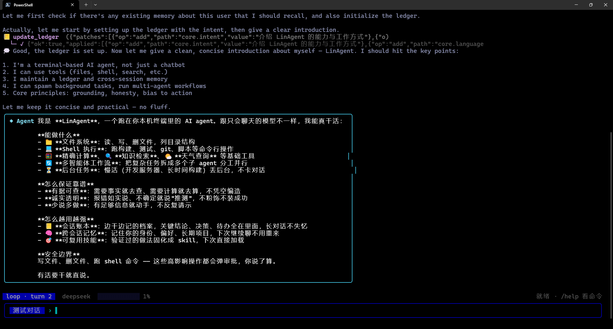
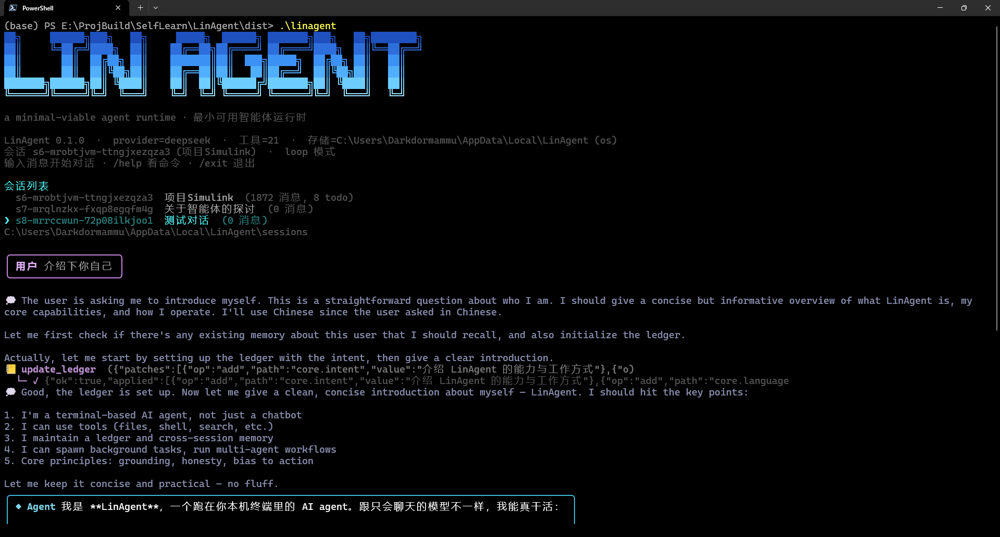
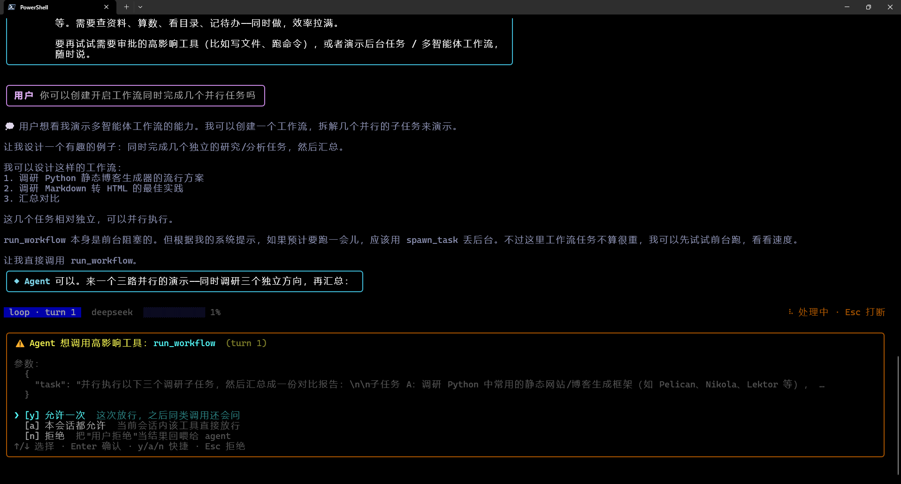
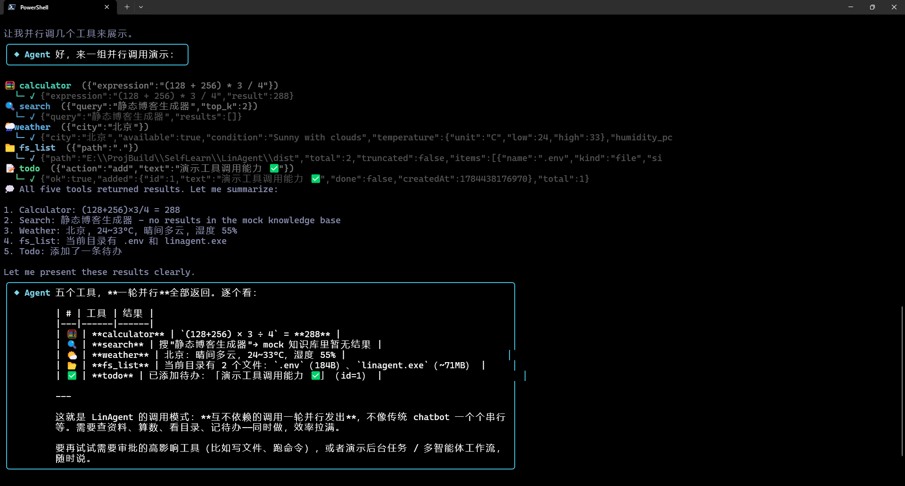
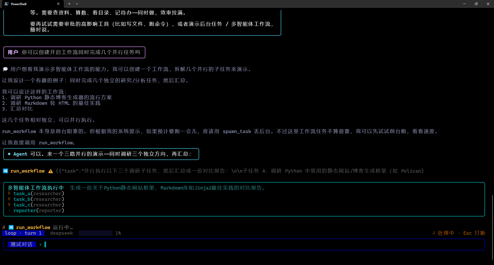

```
██╗     ██╗███╗   ██╗     █████╗  ██████╗ ███████╗███╗   ██╗████████╗
██║     ██║████╗  ██║    ██╔══██╗██╔════╝ ██╔════╝████╗  ██║╚══██╔══╝
██║     ██║██╔██╗ ██║    ███████║██║  ███╗█████╗  ██╔██╗ ██║   ██║
██║     ██║██║╚██╗██║    ██╔══██║██║   ██║██╔══╝  ██║╚██╗██║   ██║
███████╗██║██║ ╚████║    ██║  ██║╚██████╔╝███████╗██║ ╚████║   ██║
╚══════╝╚═╝╚═╝  ╚═══╝    ╚═╝  ╚═╝ ╚═════╝ ╚══════╝╚═╝  ╚═══╝   ╚═╝
```

# LinAgent

LinAgent 是一个终端环境下的 agent 运行时，使用 Node、TypeScript 与 Ink 构建，不依赖
langchain 等 agent 框架——agent 循环、LLM 客户端、工具系统、记忆与上下文压缩均为自行实现，
生产依赖仅 react、ink、commander 三项。开发过程中借助 Claude Code 辅助编码。

工具调用、多会话、loop / plan 双执行模式等能力与多数 agent 无异。项目真正着力的地方是一套
机制：让对话的类型从内容中自行涌现，并据此驱动上下文压缩与记忆召回。

## 演示

启动画面：LIN AGENT logo、会话列表（含各会话消息数 / todo 数）、provider 与存储位置。



自我介绍——先向账本写入 intent，再作答。可见 `update_ledger` 的 patch 与账本回执。



一轮并行调用 5 个工具（calculator / search / weather / fs_list / todo），互不依赖的调用一次发出，结果汇总成表。



高影响工具的审批门：`run_workflow` 调用前 fail-closed 弹审批，可选允许一次 / 本会话允许 / 拒绝。



多智能体工作流执行中：三个 researcher 子智能体并行调研，reporter 汇总——实时显示各子任务与角色。



## 从对话结构中涌现的类型

一段对话总归属于某种类型——排错、执行、方案讨论——但类型在开始时未知，且会随对话推进而
改变。常见做法或让用户手动指定，或基于关键词推断（标题含 "debug" 即判为排错），二者都不
可靠：前者依赖用户主动标注，后者容易失准——对话早已转入部署阶段，账本记录的 intent 却仍
停留在最初的 "debug"。

LinAgent 不做推断，而是让类型从对话内容中自行涌现。

Agent 在工作过程中持续向一份结构化账本写入条目：发现、决策、卡点、产物、未收尾的事项等。
每条条目先归入一组通用的关系角色（结论、决策、因果、动作、产物、卡点、备选……），再依据
上下文计算一个相对权值——被其他条目引用的、尚未解决的，权值更高。

账本中占主导的角色决定对话的类型：因果与结论居多判为排错，动作与产物居多判为执行，决策与
备选居多判为方案讨论；无明显主导时归为通用。类型由内容的结构决定，与标题无关。

类型一经确定，同时作用于两处。

其一是压缩。上下文增长触及窗口上限时，不同类型保留不同内容：排错优先保留因果链，执行优先
保留产物与进展，噪音丢弃，其余合并为摘要。有一条规则对所有类型一致——工具报错一律归档，
错误是排查的证据，不可丢失。

其二是召回。跨会话记忆的检索按当前对话类型加权：排错会话中，同类来源的记忆排序靠前。压缩
与召回共用同一套类型判断，不各自独立计算。

两者之间由一条反馈信号连接。某一类原语被反复召回，表明其权值被低估，系统随之上调该类权值
（只增不减，闲置时逐渐衰减归零，不会转为负值），使同类内容在后续更易被保留、召回，并参与
类型判断。该调整在会话内即时生效，同时持久化为下次会话的先验。

整体构成一个闭环：写入账本 → 涌现类型 → 驱动压缩与召回 → 召回结果反馈调整权值。其中没有
任何一步依赖用户指定或关键词匹配。

## 支持的工具

工具都走 provider 的原生 tool-calling 协议(OpenAI 兼容 / Anthropic 两套)注册，LLM 自主决定调哪个。
标 ⚠ 的是高影响操作，每次调用都走交互式审批。

| 工具 | 作用 |
|------|------|
| `calculator` | 算术求值(调度场算法，不执行任意代码) |
| `search` | 知识库检索(演示用 mock) |
| `weather` | 城市天气查询(演示用 mock) |
| `todo` | 会话内待办清单(add/list/done/remove/clear) |
| `fs_read` / `fs_list` | 读文件 / 列目录(只读，无需审批) |
| `fs_write` / `fs_delete` | ⚠ 写 / 删文件 |
| `bash_exec` | ⚠ 执行 shell 命令 |
| `update_ledger` | 维护会话账本(记发现/决策/…、收尾标 wrapping) |
| `recall_memory` | 按关键词召回跨会话记忆(facts / ongoing) |
| `memory` | 用户点名要记住/忘掉时，增删长期记忆 |
| `recall_archive` | 用 @segN 句柄拉回被压缩归档的原始老消息 |
| `list_skills` / `load_skill` / `create_skill` | 查 / 读 / 新建可复用技能 |
| `spawn_task` / `check_task` / `list_tasks` / `cancel_task` | 后台任务 起 / 查 / 列 / 停 |
| `run_workflow` | 把复杂任务拆给多个子智能体并行/串行编排 |

另外可通过 **MCP 客户端**连接外部 MCP 服务器，把它们的工具、资源、prompt 桥接进来当本地工具用。

## 智能体基本功能

- **双执行模式**——`loop`(经典 ReAct，边推理边执行)与 `plan`(planner 生成 DAG，verifier
  静态校验，executor 确定性执行、无依赖步骤并行)。通过 `/plan` 切换。
- **会话隔离**——各会话的历史与状态相互独立，支持新建、切换、删除。
- **上下文压缩**——输入 token 逼近窗口上限时自动触发(亦可经 `/compress` 手动触发)，机制见上一节。
- **跨会话记忆**——分 identity / preferences / facts / ongoing 四层：前两层稳定，冻结于
  system 前缀以命中缓存；后两层经 `recall_memory` 按需召回，并依召回热度在 frozen / warm /
  dormant 间动态升降级。
- **技能**——将验证有效的做法固化为可复用技能，供后续加载；agent 亦可自行创建。
- **后台任务**——长时或常驻型任务(如启动服务、长构建)转入后台异步执行，完成后自动唤醒 agent，无需轮询。
- **多智能体工作流**——确定性编排脚本，以 fan-out / pipeline 方式并行子智能体并汇总结果。
- **审批门**——文件写删、shell 执行、工作流等高影响操作 fail-closed，须经用户批准。
- **流式健壮性**——SSE 流式解析、空闲超时(避免长回复被误判超时)、参数被 max_tokens 截断时
  自动续写拼接、支持随时中断。
- **多 provider**——单套代码适配 OpenAI 兼容协议(OpenAI / DeepSeek / Moonshot 等)与 Anthropic 原生协议。

规模：约 13,000 行 src + 7,900 行测试，520 个 `node:test` 用例(519 通过 / 1 平台跳过)，
全部离线可复现(用 MockLLM，不打真接口)。

---

## 上手

```bash
cd LinAgent
npm install
cp .env.example .env    # 至少填 LLM_PROVIDER + LLM_API_KEY
```

`.env.example` 列了 9 个 provider preset(`openai` / `anthropic` / `deepseek` / `moonshot` /
`dashscope` / `zhipu` / `openrouter` / `groq` / `ollama`)，选一个填 key 即可。

> **跨平台**：源码运行(`npm start` / `npm test`)在 Windows / Linux / macOS 三系统通用——
> 存储目录、shell 执行、进程管理都按平台分派，system prompt 会把当前 OS 告诉模型让它用对命令。
> 每次提交经 GitHub Actions 在三系统 × Node 20 跑全量测试把关(见 `.github/workflows/ci.yml`)。
> 唯一不跨平台的是下面的 SEA 打包——那是 SEA 机制本身的限制，需在目标平台各自 build。

```bash
npm start                      # 启动 REPL(默认 loop 模式)
npm start -- --plan            # 开局进 plan 模式
npm start -- --provider deepseek --model deepseek-chat   # 覆盖 provider/模型
npm start -- --help            # 全部旗标

npm test                       # 离线测试(MockLLM，不打真接口)
npm run typecheck              # 类型检查
```

旗标优先级：旗标 > 环境变量 > preset 默认。可用旗标：
`--provider --model --api-key --base-url --timeout --plan --no-stream
--max-turns --context-max --home --user`。

### 打包成独立可执行(免装 Node)

基于 Node 20 SEA，把 Node runtime + 打包代码塞进一个可执行文件：

```bash
npm run build          # → dist/linagent.exe(Windows；其它平台无扩展名)
```

**仅打包产物**不跨平台(SEA 把某平台的 Node runtime 嵌进了可执行文件；要 Linux/mac 版就在对应
平台各自 build)，体积 ~70MB(内含整个 Node runtime)。源码运行本身三系统通用，见上方「跨平台」说明。

### REPL 命令

会话：`/new [标题]` `/list` `/switch <id>` `/rm <id>` `/reset` `/plan`

上下文 / 记忆 / 账本：
- `/tokens` — token 用量色条(按类别着色)
- `/compress` — 手动触发一次压缩
- `/history` — 查看当前会话消息序列(保头 / 摘要 / 保尾)
- `/ledger` — 查看当前会话账本
- `/consolidate` — 把账本沉淀进跨会话记忆
- `/emergence` — 扫全库账本看涌现的分类结构
- `/memory [list|forget <id>|clear]` — 查看/编辑记忆
- `/trace` — 打印执行 trace

工具 / 技能 / 工作流 / MCP：
- `/tools [<名字>]` — 列出已注册工具(名字/描述/参数/审批标记)；带名字看单个工具完整 schema
- `/skill [list|show <name>]` `/workflow <任务>` `/mcp`

其它：`/help` `/exit`；处理中按 Esc 打断。

## 存储位置

三级 fallback：`LINAGENT_HOME` 环境变量 → 当前目录的 `.linagent/`(项目本地覆盖) → 系统缓存目录
(Win `%LOCALAPPDATA%\LinAgent`、mac `~/Library/Caches/LinAgent`、Linux `~/.cache/LinAgent`)。

```
<home>/
├── sessions/              ← 会话历史 + 状态
├── ledgers/               ← 各会话账本(<sessionId>.json)
├── archives/              ← 压缩归档段(<sid>-segN.json，recall_archive 可拉回)
├── feedback/<userId>.json ← 反馈环的跨会话 bias 先验
└── memory/<userId>.json   ← 用户跨会话记忆
```

## 测试

```bash
npm test          # 520 个用例，全部离线、可复现
```

工具、客户端(流式/截断续写/超时/打断)、原语估值、类型涌现、压缩、记忆分层、反馈环、账本、
plan、MCP、workflow 都有回归覆盖。
